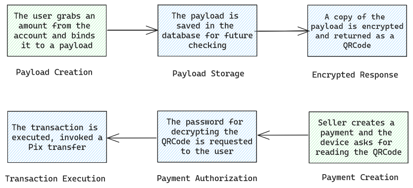

# ⚛️ Offline Pix RFC
RFC describing the "Offline Pix" feature architecture, focused on providing easy-to-use offline pix payments based on QRCodes in a safe way with security constraints and expiration time.

## Summary

- [Problem description](#Problemdescription)
- Personas
- Usability
- Security
- Profitability

## Problem description

PIX is a great way to transfer money in Brazil, it comes with a great architecture that provides reliability, speed and practicity to transfer money to anyone who has an account to a service that is integrated to the BACEN (Banco Central) api. Besides that, the technology relies too much on internet availability and that can be a problem in regions where the internet is limited or not present at all and also situations where the receiver has access to the internet but the payer don't. This solution focus on a two-way product that aims to solve these problems by providing a reliable, secure and high-customizable method to transfer money through pix, using QR Codes.

## Personas

- *emitter* of a offline PIX QRCode
- *receivers* of a offline PIX QRCode
- *intermediator* of the transactions

<br>

- The **emitter** is the person that will use the application/webserver to emit the QRCode to be used offline.
- The **receivers** is the group of people that will receive transactions using the QRCode provided by the **emitter**
- The **intermediator** is the application/webserver that is providing the entire feature

> [!IMPORTANT]  
> The **intermediator** must control an account possessed by the **emitter** in order to automatically schedule
> and send PIX transactions to the **receivers**, otherwise a manual action will be needed, defeating the purpose of
> providing offline transactions.

## Usability



The QRCode consists of a payload created by the **emitter** through the **intermediator**'s application/webserver that will be encrypted with a passowrd and will have necessarily a expiration time that can not be higher than **12 hours** from the creation time. The payload will be both stored on the database and providing an encrypted + turned into a shareable QRCode copy to the user, having the following data:

- uuid: The offline pix QRCode id, necessary to finding the transaction in the DB
- createdAt: ISO String representing the creation date of the payload
- expiresAt: ISO String representing the customized expiration date of the payload
- emitterId: ID referent to the emitter, can be String or Integer
- initialValueAmount: Maximum quantity in cents borrowed from the emitter account to be spent using the QRCode
- currentValueAmount: Current quantity available in the QRCode to spend (Not included in the QRCode payload, only database)

The final payload (json, encrypted and QRCode) may look like that:


```js
{
  "uuid": "3e3602c1-62a1-4375-ad02-093d7bdf822f",
  "createdAt": "2011-10-05T14:48:00.000Z",
  "expirestAt": "2011-10-05T14:48:00.000Z",
  "emitterId": "c0c199f2-0964-4ff4-a3af-6dd2c9425c27",
  "initialValueAmount": 10000
}
```
```
wvpqBILAKI+Nq7BUgGE1meZaDL7E2easj7K1cGb3V/luMp5eKVPvMlz2qrWP0c9UZcXplE66Q9+il1YYrud0VhLLNKIGWMPeyR10pjS2hFVcd2/C0vxmKqKKZU4HK/qouT95feCzp7BlZj4DMdZQCma7fAhXR/YYp//g6WAx00rN/4Hh2ojegL692m6shPQ9ORKef64imUZQfp5hn5JRjW0hZkfJ5EA0b9PQ/5QmcKU=
```

The **receivers** can read the QRCode using the **intermediator**'s application/webserver and it will prompt the amount and password to be put - just like credit cards - in order to decrypt and access the payload data. Then, the **intermediator** will compare each field of the decrypted data to the equivalent store in the database. The operation may be a success and the final PIX transaction with the desired amount may be scheduled to be executed if all the fields are the exact same as the provided decrypted data. 

### Failure points

| Name | Description |
| - | - |
| Amount exceeds the QRCode limit | happens when the `currentValueAmount` is less than the value that the **receiver** tried to receive in the transaction |
| Invalid QRCode | happens when the QRCode was expired or manually invalidated by the **emitter** through the **intermediator** application/webservice |
| Security Exception | something wrong was found during the transaction and it was forcibly cancelled to avoid bigger problems, in that case the QRCode may be invalidated automatically |

## Security

There are some security cares that may be taken during the implementation of the QRCode and the system itself, starting by location-based checks before every transaction. Security exceptions may be raised when: a first transaction was made at least 500 kilometers from another between a very short period - usually 1 hour or a first transaction is trying to be executed from a place too far from where the QRCode was created (usually 500 kilometers) in a very short period, also usually 1 hour. The **intermediator** should also be prepared to take care about brute force attacks, so it may be prepared to identify different kinds of payloads trying to execute in a very short periods of time with a field in common. Besides that, the **intermediator** should also be able to invalidate any created QRCode from outside the main application/webservice for any reason and also block future QRCode creations if it is explicitly desired by the client.

## Profitability

There are some points from where the **intermediator** can profit providing the offline pix feature:

- *transfer fees* - fees that are applied to every transference during the utilization of the QRCode, it's a small fee, usually between 0.3% to 0.5% of the amound applied as additional value;
- *creational fees* - a fee that is applied during the QRCode creation, it can be a small percentage (1% to 1.5%) of the total amound value grabbed in the QRCode
- *market partnership* - being partner with selling companies to offer distinguished treatment and easily implement the offline pix, charging a small amount per month
- *charging the sellers* - making the feature paid for the stores and the sellers that want to accept offline pix payments and keeping it free for the users
